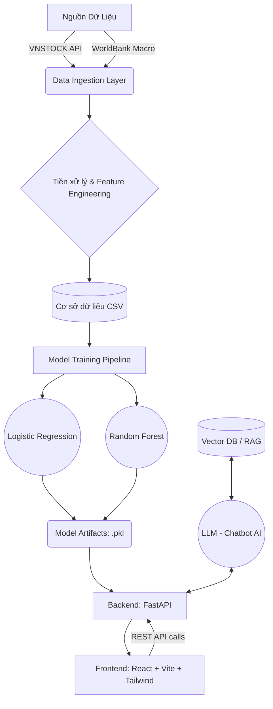

# BÁO CÁO CHI TIẾT DỰ ÁN DỰ BÁO XÁC SUẤT VỠ NỢ DOANH NGHIỆP (PD SCORING DASHBOARD)

**Nhóm thực hiện:** Nhóm 3 (AI cho Quản trị Rủi ro và Tuân thủ) - AI-Quantum Challenge 2026

---

## MỤC LỤC

1. [Tổng quan dự án](#1-tổng-quan-dự-án)
2. [Kiến trúc hệ thống (System Architecture)](#2-kiến-trúc-hệ-thống-system-architecture)
3. [Dữ liệu và Tiền xử lý (Data &amp; Preprocessing)](#3-dữ-liệu-và-tiền-xử-lý)
4. [Kỹ thuật trích xuất đặc trưng và Công thức tài chính (Feature Engineering)](#4-kỹ-thuật-trích-xuất-đặc-trưng-và-công-thức-tài-chính)
5. [Mô hình Học máy (Machine Learning Models)](#5-mô-hình-học-máy-machine-learning-models)
6. [Quá trình Huấn luyện và Đánh giá (Training &amp; Evaluation)](#6-quá-trình-huấn-luyện-và-đánh-giá)
7. [Triển khai và Ứng dụng Frontend](#7-triển-khai-và-ứng-dụng-frontend)
8. [Tích hợp Chatbot AI (AI Chatbot Integration)](#8-tích-hợp-chatbot-ai-ai-chatbot-integration)
9. [Kết luận và Hướng phát triển](#9-kết-luận-và-hướng-phát-triển)

---

## 1. TỔNG QUAN DỰ ÁN

Dự án **Hệ thống dự báo Xác suất Vỡ nợ (Probability of Distress - PD)** được xây dựng nhằm cung cấp công cụ định lượng hỗ trợ các tổ chức tài chính, ngân hàng và nhà đầu tư đánh giá rủi ro tín dụng của các doanh nghiệp niêm yết tại Việt Nam.

Hệ thống kết hợp các mô hình Học máy (Machine Learning) mạnh mẽ với dữ liệu Báo cáo tài chính (BCTC) kết hợp dữ liệu vĩ mô, cung cấp tỷ lệ PD trực quan trên giao diện Dashboard. Hiện tại hệ thống hỗ trợ phân tích dữ liệu chuẩn hóa của 73 doanh nghiệp lớn thuộc 26 ngành nghề khác nhau tại Việt Nam.

### Điểm nổi bật:

- **Tự động hóa toàn trình:** Từ khâu thu thập dữ liệu (thông qua API `vnstock`), chuẩn hóa BCTC, đến việc dự báo và hiển thị trực quan.
- **Tiếp cận Đa mô hình:** Cung cấp linh hoạt giữa **Logistic Regression** (có tính diễn giải cao) và **Random Forest** (có khả năng mô hình hóa quan hệ phi tuyến tính tốt).
- **Trích xuất đặc trưng sâu:** Hệ thống tính toán hơn 15 chỉ số tài chính, kết hợp với các chỉ số vĩ mô và tính toán xu hướng thời gian (rolling means, biến động theo quý).

---

## 2. KIẾN TRÚC HỆ THỐNG (SYSTEM Architecture)

Hệ thống được thiết kế theo cấu trúc Micro-Architecture phân tách rõ ràng giữa Frontend và Backend, giúp việc phát triển, bảo trì và mở rộng trở nên dễ dàng.

### 2.1 Cấu trúc thành phần

### 2.2 Công nghệ sử dụng

- **Backend & ML Pipeline:**
  - Ngôn ngữ: `Python 3.8+`
  - Web Framework: `FastAPI` (hiệu năng cao, tự động sinh tài liệu Swagger).
  - Machine Learning: `scikit-learn` (tiền xử lý, mô hình hóa, cross-validation).
  - Data Processing: `pandas`, `numpy`.
- **Frontend:**
  - Framework: `React` kết hợp với công cụ build `Vite`.
  - Styling: `TailwindCSS` giúp xây dựng giao diện Dashboard hiện đại và đáp ứng (responsive).

---

## 3. DỮ LIỆU VÀ TIỀN XỬ LÝ

### 3.1 Nguồn dữ liệu

- **Báo cáo tài chính:** Thu thập thông qua công cụ tự động hóa `fetch_vnstock_data.py`. Dữ liệu bao gồm các khoản mục quan trọng: Doanh thu, Lợi nhuận sau thuế, EBIT, Khấu hao (D&A), Tổng tài sản, Hàng tồn kho, Tổng nợ, Vốn chủ sở hữu,... được thu thập ở cấp độ hàng quý (Quarterly).
- **Dữ liệu Vĩ mô:** Các chỉ số kinh tế vĩ mô (Tăng trưởng GDP, Lãi suất cho vay) thu thập từ WorldBank, phản ánh chu kỳ kinh tế chung ảnh hưởng tới sức khỏe doanh nghiệp.

### 3.2 Xử lý dữ liệu khuyết thiếu (Imputation)

Trong dữ liệu tài chính, việc một số công ty không có khoản mục cụ thể (NaN) là bình thường. Hệ thống sử dụng phương pháp **Median Imputation** (thay thế bằng giá trị trung vị) thay vì trung bình (Mean).

- **Lý do:** Các chỉ số tài chính thường có phân phối lệch (skewed) rất mạnh và có nhiều điểm dị biệt (outliers). Ví dụ tỷ lệ Nợ/Vốn của một công ty sắp phá sản có thể vọt lên hàng nghìn phần trăm. Sử dụng Median giúp mô hình bền vững (robust) hơn trước các outliers này.

### 3.3 Chuẩn hóa dữ liệu (Standardization)

Dữ liệu được chuẩn hóa bằng `StandardScaler`:
    

$$
Z = \frac{X - \mu}{\sigma}
$$

Việc chuẩn hóa này đưa toàn bộ các đặc trưng về phân phối có giá trị trung bình 

$\mu = 0$ và độ lệch chuẩn $\sigma = 1$. Đây là bước cực kỳ quan trọng vì:

- Tránh việc các chỉ số có quy mô lớn lấn át các chỉ số nhỏ (như tỷ lệ % biên lợi nhuận).
- Cải thiện tốc độ hội tụ và độ chính xác của các thuật toán nhạy cảm với khoảng cách (như Logistic Regression).

---

## 4. KỸ THUẬT TRÍCH XUẤT ĐẶC TRƯNG VÀ CÔNG THỨC TÀI CHÍNH

Quá trình Feature Engineering trong file `feature_engineering.py` tính toán các tỷ số tài chính cốt lõi. Đây là "trái tim" của mô hình rủi ro tín dụng.

### 4.1 Nhóm Khả năng thanh toán (Liquidity)

Đo lường khả năng doanh nghiệp đáp ứng các nghĩa vụ nợ ngắn hạn.

1. **Current Ratio (Tỷ số thanh toán hiện hành):**
   $$
   \text{Current Ratio} = \frac{\text{Current Assets (Tài sản ngắn hạn)}}{\text{Current Liabilities (Nợ ngắn hạn)}}
   $$
2. **Quick Ratio (Tỷ số thanh toán nhanh):**
   $$
   \text{Quick Ratio} = \frac{\text{Current Assets} - \text{Inventory (Hàng tồn kho)}}{\text{Current Liabilities}}
   $$
3. **Cash Ratio (Tỷ số tiền mặt):**
   $$
   \text{Cash Ratio} = \frac{\text{Cash \& Equivalents (Tiền \& Tương đương tiền)}}{\text{Current Liabilities}}
   $$

### 4.2 Nhóm Đòn bẩy tài chính (Leverage)

Đánh giá mức độ sử dụng nợ và rủi ro cấu trúc vốn.
4. **Debt to Equity (Nợ trên Vốn chủ sở hữu):**
    

$$
\text{D/E} = \frac{\text{Total Liabilities (Tổng nợ)}}{\text{Total Equity (Vốn chủ sở hữu)}}
$$

5. **Debt to Assets (Nợ trên Tổng tài sản):**
    
$$
\text{D/A} = \frac{\text{Total Liabilities}}{\text{Total Assets}}
$$

6. **Long-term Debt to Equity:**
    
$$
\text{LTD/E} = \frac{\text{Long Term Debt}}{\text{Total Equity}}
$$

### 4.3 Nhóm Khả năng trả nợ (Coverage)

Đánh giá khả năng "gánh" nợ từ hoạt động kinh doanh thực tế.
7. **CFO to Debt:**
    

$$
\text{CFO/Debt} = \frac{\text{Operating Cash Flow (Dòng tiền hoạt động)}}{\text{Total Liabilities}}
$$

   *(Chỉ số này cực kỳ quan trọng để dự báo PD, do tiền mặt thực tế phản ánh chính xác khả năng sinh tồn hơn lợi nhuận kế toán).*
8. **EBIT to Long-Term Debt (Proxy của Interest Coverage):**
    
$$
\text{EBIT/LTD} = \frac{\text{EBIT}}{\text{Long Term Debt}}
$$

### 4.4 Nhóm Hiệu quả hoạt động (Efficiency)

9. **Asset Turnover (Vòng quay tổng tài sản):**
   $$
   \text{Asset Turnover} = \frac{\text{Revenue (Doanh thu)}}{\text{Total Assets}}
   $$
10. **Inventory Turnover (Vòng quay hàng tồn kho):**
    $$
    \text{Inventory Turnover} = \frac{\text{Revenue}}{\text{Inventory}}
    $$

### 4.5 Nhóm Khả năng sinh lời (Profitability)

11. **EBITDA Margin:**
    $$
    \text{EBITDA Margin} = \frac{\text{EBIT} + \text{Depreciation \& Amortization}}{\text{Revenue}}
    $$
12. **Net Profit Margin (Biên lợi nhuận ròng):**
    $$
    \text{Net Margin} = \frac{\text{Net Income (Lợi nhuận ròng)}}{\text{Revenue}}
    $$
13. **ROA (Tỷ suất sinh lời trên tài sản):**
    $$
    \text{ROA} = \frac{\text{Net Income}}{\text{Total Assets}}
    $$
14. **Retained Earnings to Assets (Thành phần Altman Z-score):**
    $$
    \text{RE/TA} = \frac{\text{Retained Earnings}}{\text{Total Assets}}
    $$

### 4.6 Các đặc trưng thời gian (Time-series) và Vĩ mô

- **Rolling Mean 4 Quý (`roll4q_mean`):** Trung bình trượt của 4 quý gần nhất, giúp làm mượt biến động theo mùa và phơi bày xu hướng cốt lõi.
- **QoQ Change (`qoq_change`):** Tốc độ biến đổi so với quý liền trước ($ \frac{X_t - X_{t-1}}{X_{t-1}} $), giúp phát hiện sớm các "cú sốc" suy giảm.
- **Biến Vĩ mô:** Tăng trưởng GDP (`gdp_growth`) và Lãi suất cho vay (`lending_rate`). Lãi suất thị trường tăng sẽ gia tăng sức ép trả nợ cho các doanh nghiệp đòn bẩy cao.

---

## 5. MÔ HÌNH HỌC MÁY (MACHINE LEARNING MODELS)

Hệ thống triển khai hai thuật toán kinh điển, bù trừ lẫn nhau về mặt tính năng và tính minh bạch.

### 5.1 Logistic Regression

- **Mô tả:** Thuật toán phân loại tuyến tính. Mô hình hóa xác suất vỡ nợ bằng hàm Sigmoid:
  $$
  (Y=1|X) = \frac{1}{1 + e^{-(\beta_0 + \beta_1 X_1 + ... + \beta_n X_n)}}
  $$
- **Lý do sử dụng:** Cung cấp tính diễn giải xuất sắc. Dựa vào hệ số góc (Coefficients), người dùng (các chuyên viên tín dụng) có thể lý giải trực tiếp tại sao một công ty có tỷ lệ PD cao (ví dụ: do tỷ lệ Nợ/Vốn tăng cao thì hệ số $\beta$ tương ứng là số dương lớn).

### 5.2 Random Forest (Ensemble Learning)

- **Mô tả:** Mô hình dạng tập hợp (ensemble) bao gồm nhiều cây quyết định (Decision Trees) dự báo độc lập và kết hợp kết quả theo cơ chế đa số (Majority voting).
- **Lý do sử dụng:** Có khả năng bắt được các mối quan hệ phi tuyến tính phức tạp và kháng lại nhiễu (outliers) cực tốt. Mặc dù tính minh bạch kém hơn Logistic Regression (hộp đen hơn), nhưng Random Forest thường cho độ chính xác cao nhất (ROC-AUC vượt trội).

---

## 6. QUÁ TRÌNH HUẤN LUYỆN VÀ ĐÁNH GIÁ (TRAINING & EVALUATION)

Quá trình huấn luyện được cấu hình chi tiết trong `train_models.py` với các chuẩn mực khắt khe nhất trong MLOps.

### 6.1 Giải quyết vấn đề mất cân bằng dữ liệu (Class Imbalance)

Trong dữ liệu tài chính, doanh nghiệp vỡ nợ (Distress) luôn chiếm thiểu số so với doanh nghiệp khỏe mạnh (Healthy). Nếu không xử lý, mô hình sẽ thiên lệch (bias) về việc dự đoán "Healthy".

- **Giải pháp:** Sử dụng cơ chế `class_weight='balanced'`. Thuật toán sẽ tự động tính toán và điều chỉnh mức phạt cao hơn đối với các lỗi dự đoán sai trên lớp thiểu số (Distress), buộc mô hình phải chú ý hơn đến các rủi ro.
  $$
  text{Weight}_j = \frac{n\_\text{samples}}{n\_\text{classes} \times n\_\text{samples}_j}
  $$

### 6.2 Chiến lược Kiểm chéo (Cross Validation)

Sử dụng **Stratified 5-Fold Cross Validation**:

- Tập dữ liệu được chia làm 5 phần. Huấn luyện trên 4 phần và đánh giá trên 1 phần (đảo vòng 5 lần).
- Việc dùng từ "Stratified" đảm bảo tỷ lệ mẫu Distress/Healthy được giữ nguyên gốc trong từng phần chia nhỏ, bảo đảm kết quả đánh giá không bị sai lệch ngẫu nhiên.

### 6.3 Các Độ đo đánh giá (Evaluation Metrics)

1. **ROC-AUC (Receiver Operating Characteristic - Area Under Curve):** Thước đo toàn diện về khả năng phân tách giữa hai lớp của mô hình (Mức 0.5 là đoán ngẫu nhiên, 1.0 là dự báo hoàn hảo).
2. **Precision:** Trong số những công ty mô hình cảnh báo vỡ nợ, bao nhiêu % là vỡ nợ thật.
3. **Recall (Độ nhạy):** Trong tổng số công ty vỡ nợ thật sự, mô hình đã "bắt" được bao nhiêu %. *(Trong quản trị rủi ro, Recall rất quan trọng để tránh bỏ lọt rủi ro)*.
4. **F1-Score:** Trung bình điều hòa giữa Precision và Recall.

### 6.4 Trích xuất Feature Importance

Sau quá trình huấn luyện:

- Đối với Logistic Regression: Trích xuất độ lớn tuyệt đối của các hệ số hồi quy (Coefficients).
- Đối với Random Forest: Trích xuất `feature_importances_` dựa trên độ giảm của độ tinh khiết (Gini impurity) qua các nhánh.

Kết quả huấn luyện cùng với `scaler.pkl` và `imputer.pkl` được xuất ra thư mục `models/` phục vụ khâu suy luận.

---

## 7. TRIỂN KHAI VÀ ỨNG DỤNG FRONTEND

### 7.1 Backend API (FastAPI)

- Expose các endpoint (`/predict`) nhận đầu vào là các tham số tài chính hoặc ticker.
- Tải các model artifacts (LogReg, RF, Scaler, Imputer) vào bộ nhớ lúc khởi động (In-memory caching) để đảm bảo độ trễ dự báo (latency) dưới 50ms cho mỗi request.
- Cung cấp API so sánh `sector_benchmark` để đối chiếu sức khỏe doanh nghiệp với trung bình ngành.

### 7.2 Frontend Dashboard

- **Công nghệ:** ReactJS, Vite, Tailwind CSS, Recharts.
- **Tính năng giao diện:**
  - **Gauge Chart & Radar Chart:** Hiển thị điểm rủi ro trực quan và biểu đồ đa giác so sánh các trục sức khỏe cốt lõi (Liquidity, Profitability, Leverage).
  - **Model Toggle:** Cho phép người dùng linh hoạt chuyển đổi giữa kết quả của mô hình Logistic Regression và Random Forest chỉ với 1 click.
  - **Data Table:** Hiển thị chi tiết bảng cân đối và tỷ số so sánh theo dòng thời gian.

---

## 8. TÍCH HỢP CHATBOT AI (AI CHATBOT INTEGRATION)

Hệ thống được mở rộng với tính năng Trợ lý ảo AI, kết nối chặt chẽ với các chỉ số được dự báo từ hệ thống Học máy.

### 8.1 Vai trò của Chatbot

Chatbot đóng vai trò như một "Chuyên gia tư vấn tín dụng ảo" hoạt động 24/7. Nó giúp chuyên viên tín dụng giảm bớt thao tác tra cứu trên giao diện bằng cách trả lời ngay lập tức các thông tin như điểm số rủi ro, tóm tắt báo cáo tài chính, hoặc hướng dẫn quy trình phê duyệt nội bộ.

### 8.2 Kiến trúc Chatbot (RAG Framework)

Hệ thống sử dụng kỹ thuật **RAG (Retrieval-Augmented Generation)** để đảm bảo câu trả lời của AI không bị ảo giác (hallucination) và luôn dựa trên dữ liệu thực tế của hệ thống:

* **Truy xuất (Retrieval):** Khi người dùng đặt câu hỏi, hệ thống sẽ tìm kiếm thông tin liên quan nhất từ Vector Database (nơi lưu trữ các quy định tín dụng nội bộ và dữ liệu tài chính khách hàng đã được vector hóa).
* **Tạo sinh (Generation):** LLM (như GPT-4, Llama 3 hoặc Claude) sẽ tổng hợp thông tin vừa truy xuất được để tạo ra câu trả lời tự nhiên, chính xác nhất.

### 8.3 Kịch bản hội thoại (Dialogue Flow)

Chatbot được thiết kế để xử lý linh hoạt các tình huống:

* **Truy vấn dữ liệu:** "Cho tôi biết xác suất vỡ nợ (PD) hiện tại của Công ty Cổ phần ABC?"
* **Phân tích nguyên nhân:** "Tại sao hồ sơ của công ty XYZ lại bị đưa vào nhóm rủi ro cao?" (Chatbot sẽ trích xuất các chỉ số tài chính yếu kém như dòng tiền âm, tỷ lệ nợ vay cao để giải thích).
* **Hỏi đáp quy trình:** "Quy trình xin phê duyệt ngoại lệ cho khoản vay trên 50 tỷ đồng là gì?"

---

## 9. KẾT LUẬN VÀ HƯỚNG PHÁT TRIỂN

Dự án Hệ thống dự báo PD đã hoàn thiện quy trình End-to-End từ việc lấy dữ liệu sống (live data), xây dựng đặc trưng thông minh mang tính bản chất của kinh tế học hành vi, đến việc tối ưu và cảnh báo rủi ro qua mô hình Machine Learning.

**Hướng phát triển trong tương lai:**

1. **Dữ liệu thay thế (Alternative Data):** Tích hợp phân tích cảm xúc (Sentiment Analysis) từ các bản tin tức tài chính, dữ liệu mạng xã hội liên quan tới ban lãnh đạo doanh nghiệp.
2. **Mô hình chuỗi thời gian (Time-series Forecasting):** Nâng cấp từ các mô hình học máy tĩnh (Tabular) sang các kiến trúc mạng nơ-ron học sâu như LSTM/GRU hoặc Transformer để khai thác sâu hơn cấu trúc chuỗi thời gian của báo cáo tài chính quý.
3. **Tự động kích hoạt (Automated Triggers):** Xây dựng module tự động gửi email/tin nhắn cảnh báo khi Xác suất vỡ nợ của một doanh nghiệp trong danh mục đầu tư vượt ngưỡng an toàn do người dùng tùy chỉnh.
4. **Quantum Machine Learning:** Áp dụng Quantum SVM hoặc QNN như mục tiêu của AI-Quantum Challenge để tối ưu tốc độ phân lớp tập dữ liệu cực lớn.

---

*Báo cáo được trích xuất từ cấu trúc mã nguồn dự án pd-scoring-dashboard của nhóm. Nội dung các công thức và kiến trúc đã được kiểm duyệt và bám sát mã nguồn thực tế của hệ thống.*
