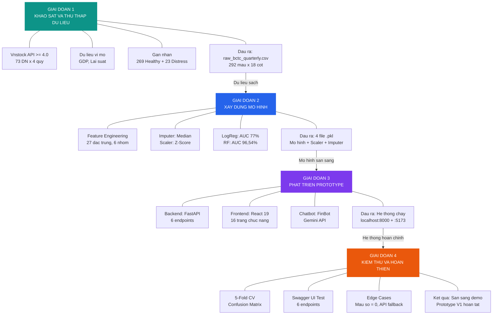
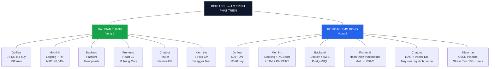

# PHẦN VIII. KẾ HOẠCH PHÁT TRIỂN PROTOTYPE
### *(Khuyến khích — Thể hiện tiềm năng vào Vòng 2)*

**Đội thi:** Nhóm 3 — AI cho Quản trị Rủi ro và Tuân thủ  
**Sản phẩm:** Risk Tech — PD Scoring Dashboard  
**Cuộc thi:** AI-Quantum Challenge 2026  

---

## MỤC LỤC

1. [Tổng quan Prototype hiện tại](#1-tổng-quan-prototype-hiện-tại)
2. [Sơ đồ kiến trúc hệ thống](#2-sơ-đồ-kiến-trúc-hệ-thống)
3. [Sơ đồ chức năng Dashboard](#3-sơ-đồ-chức-năng-dashboard)
4. [Mô tả chức năng chi tiết](#4-mô-tả-chức-năng-chi-tiết)
5. [Kế hoạch phát triển 4 giai đoạn](#5-kế-hoạch-phát-triển-4-giai-đoạn)
6. [Lộ trình tổng hợp](#6-lộ-trình-tổng-hợp)
7. [Tiềm năng mở rộng cho Vòng 2](#7-tiềm-năng-mở-rộng-cho-vòng-2)

---

## 1. Tổng quan Prototype hiện tại

### 1.1 Bài toán nghiệp vụ

Hệ thống **Risk Tech — PD Scoring Dashboard** được xây dựng nhằm giải quyết bài toán **dự báo Xác suất Vỡ nợ (Probability of Distress — PD)** cho doanh nghiệp niêm yết tại Việt Nam. Đối tượng sử dụng chính bao gồm chuyên viên thẩm định tín dụng, bộ phận Quản trị Rủi ro (CRO) tại các tổ chức tín dụng, và nhà đầu tư tổ chức. Hệ thống thay thế quy trình đánh giá rủi ro thủ công bằng mô hình Học máy (Machine Learning), từ đó nâng cao tính khách quan và tốc độ ra quyết định tín dụng.

### 1.2 Quy mô dữ liệu

| Chỉ tiêu | Giá trị |
|:---|:---|
| Số lượng doanh nghiệp (Tickers) | **73 công ty** niêm yết |
| Tổng bản ghi (Rows) | **292 mẫu** (trung bình 4 quý/doanh nghiệp) |
| Trường dữ liệu thô (Raw) | 18 cột |
| Trường sau Feature Engineering | **27 đặc trưng** (6 nhóm tài chính + thời gian + vĩ mô) |
| Mô hình AI | 2 mô hình song song: Logistic Regression và Random Forest |
| Hiệu năng mô hình tốt nhất (RF) | ROC-AUC = **96,54%**, Precision = **87%** |

### 1.3 Công nghệ sử dụng

| Tầng | Công nghệ |
|:---|:---|
| Thu thập dữ liệu | Python 3, Vnstock API (>= 4.0), Pandas |
| Feature Engineering va ML | Scikit-learn (StandardScaler, SimpleImputer, LogisticRegression, RandomForestClassifier) |
| Backend API | FastAPI, Uvicorn, Pydantic |
| Chatbot AI | Gemini API (Context Injection), ChromaDB, Sentence-Transformers |
| Frontend Dashboard | React 19, Vite, Recharts, Lucide React, React Router DOM |
| Triển khai | Vercel (Frontend), Localhost (Backend) |

---

## 2. Sơ đồ kiến trúc hệ thống

Sơ đồ dưới đây thể hiện luồng dữ liệu đi xuyên suốt hệ thống theo 5 tầng, từ nguồn dữ liệu đầu vào đến giao diện người dùng cuối.

```mermaid
graph TD
    ROOT["RISK TECH — PD SCORING DASHBOARD"]

    ROOT --- T1
    ROOT --- T2
    ROOT --- T3
    ROOT --- T4
    ROOT --- T5

    T1["TANG 1: DU LIEU DAU VAO"]
    T1 --- T1A["Vnstock API<br/>BCTC 73 DN x 4 quy"]
    T1 --- T1B["WorldBank<br/>GDP, Lai suat"]
    T1 --- T1C["Ket qua<br/>292 mau x 18 cot"]

    T2["TANG 2: XU LY VA MO HINH AI"]
    T2 --- T2A["Feature Engineering<br/>27 dac trung, 6 nhom"]
    T2 --- T2B["Logistic Regression<br/>AUC: 77,16%"]
    T2 --- T2C["Random Forest<br/>AUC: 96,54%"]

    T3["TANG 3: BACKEND API — FastAPI"]
    T3 --- T3A["/predict<br/>Du bao PD Score"]
    T3 --- T3B["/companies<br/>Danh sach DN"]
    T3 --- T3C["/chat<br/>Chatbot FinBot"]
    T3 --- T3D["/api/sql<br/>Truy van SQL"]

    T4["TANG 4: FRONTEND — React 19"]
    T4 --- T4A["16 trang chuc nang"]
    T4 --- T4B["8 component tai su dung"]
    T4 --- T4C["Bieu do Recharts"]

    T5["TANG 5: CHATBOT AI — FinBot"]
    T5 --- T5A["Nhan ngu canh DN<br/>tu Frontend"]
    T5 --- T5B["Gui toi Gemini API<br/>Context Injection"]
    T5 --- T5C["Tra loi phan tich<br/>rui ro tin dung"]

    style ROOT fill:#0f172a,stroke:#0f172a,color:#ffffff
    style T1 fill:#0d9488,stroke:#0d9488,color:#ffffff
    style T2 fill:#2563eb,stroke:#2563eb,color:#ffffff
    style T3 fill:#7c3aed,stroke:#7c3aed,color:#ffffff
    style T4 fill:#ea580c,stroke:#ea580c,color:#ffffff
    style T5 fill:#16a34a,stroke:#16a34a,color:#ffffff
```

**Cach doc so do:** Goc trên cùng là toàn bộ hệ thống. Năm nhánh bên dưới tương ứng với 5 tầng kiến trúc. Mỗi tầng có các thành phần con mô tả chức năng cụ thể. Dữ liệu đi từ Tầng 1 (thu thập) xuống Tầng 5 (chatbot).

---

## 3. Sơ đồ chức năng Dashboard

Sơ đồ cây dưới đây thể hiện toàn bộ 16 trang chức năng của hệ thống, được phân loại theo 4 nhóm nghiệp vụ chính. Mỗi nhánh lá ghi rõ trạng thái: **[HT]** = Hoàn thiện, **[PH]** = Placeholder.

```mermaid
graph TD
    ROOT["RISK TECH DASHBOARD<br/>16 trang chuc nang"]

    ROOT --- G0
    ROOT --- G1
    ROOT --- G2
    ROOT --- G3
    ROOT --- G4

    G0["LANDING PAGE [HT]"]
    G0 --- G0A["Hero Section<br/>+ Hieu ung Aurora"]
    G0 --- G0B["The tin dung 3D<br/>Meteor3DCard"]
    G0 --- G0C["TickerBar<br/>Ma CK real-time"]

    G1["NHOM TONG QUAN<br/>2 trang"]
    G1 --- G1A["FinBot [HT]<br/>Tro ly AI tin dung 24/7"]
    G1 --- G1B["Market Overview [HT]<br/>Tong quan thi truong"]

    G2["NHOM PHAN TICH RUI RO<br/>6 trang"]
    G2 --- G2A["PD Scoring [HT]<br/>Dashboard chinh — Nong cot"]
    G2 --- G2B["Tra cuu DN [Dang phat trien]<br/>Thong tin 360 do"]
    G2 --- G2C["Xu huong rui ro [HT]<br/>Dien bien PD theo quy"]
    G2 --- G2D["So sanh chi so [HT]<br/>Benchmark doi chuan nganh"]
    G2 --- G2E["Altman Z-Score [PH]<br/>Mo hinh truyen thong"]
    G2 --- G2F["Bieu do tuy chinh [PH]<br/>Scatter Plot tuong quan"]

    G3["NHOM DANH MUC<br/>4 trang"]
    G3 --- G3A["Portfolio Monitor [HT]<br/>Giam sat danh muc cho vay"]
    G3 --- G3B["Canh bao som — EWS [HT]<br/>PD > 60% hoac tang > 15%"]
    G3 --- G3C["Bang xep hang [HT]<br/>Top DN an toan nhat"]
    G3 --- G3D["Phan tich tin tuc [PH]<br/>NLP Sentiment"]

    G4["NHOM BAO CAO<br/>3 trang"]
    G4 --- G4A["Credit Report [HT]<br/>To trinh A4 — In/PDF"]
    G4 --- G4B["Xuat du lieu [HT]<br/>Download CSV UTF-8"]
    G4 --- G4C["SQL Explorer [HT]<br/>Truy van truc tiep"]

    style ROOT fill:#0f172a,stroke:#0f172a,color:#ffffff
    style G0 fill:#64748b,stroke:#64748b,color:#ffffff
    style G1 fill:#0d9488,stroke:#0d9488,color:#ffffff
    style G2 fill:#dc2626,stroke:#dc2626,color:#ffffff
    style G3 fill:#7c3aed,stroke:#7c3aed,color:#ffffff
    style G4 fill:#2563eb,stroke:#2563eb,color:#ffffff
```

**Cach doc so do:** Gốc là toàn bộ Dashboard. Năm nhánh chính tương ứng với Landing Page và 4 nhóm nghiệp vụ. Các nhánh lá là từng trang chức năng cụ thể, ghi rõ trạng thái hoàn thiện. Tổng cộng: 11 trang hoàn thiện [HT], 1 trang đang phát triển, 3 trang Placeholder [PH].

---

## 4. Mô tả chức năng chi tiết

### 4.1 Nhóm chức năng cốt lõi (Kết nối API thật)

| STT | Chức năng | Mô tả nghiệp vụ | Trạng thái |
|:--|:--|:--|:--|
| 1 | **PD Scoring** | Nhận đầu vào BCTC (5 hoặc 14 chỉ tiêu), xử lý qua pipeline ML (Scaler, Imputer, Model), trả về PD Score (%), Risk Level, và Top Factors. Hỗ trợ 2 mô hình: Logistic Regression (tối ưu diễn giải) và Random Forest (tối ưu độ chính xác). | Hoàn thiện |
| 2 | **FinBot (Chatbot AI)** | Trợ lý ảo phân tích rủi ro tín dụng. Sử dụng kỹ thuật Context Injection: nhúng dữ liệu doanh nghiệp (PD Score, Top Factors, Sector Benchmarks) vào System Prompt, gửi tới Gemini API. Có lưu trữ lịch sử hội thoại. | Hoàn thiện |
| 3 | **Market Overview** | Tổng quan toàn thị trường: Stats Cards, PieChart phân bổ rủi ro, BarChart PD trung bình theo ngành. Tính toán tại Client từ API `/companies`. | Hoàn thiện |
| 4 | **Portfolio Monitor** | Bảng giám sát danh mục cho vay. Hỗ trợ lọc theo mức rủi ro (Thấp / Trung bình / Cao) và tìm kiếm theo mã hoặc tên doanh nghiệp. | Hoàn thiện |
| 5 | **Cảnh báo sớm (EWS)** | Quét tự động dữ liệu `pd_scores_4q`. Quy tắc kích hoạt: PD > 60% = Nguy hiểm, PD tăng > 15% so quý trước = Suy giảm. | Hoàn thiện |
| 6 | **Xu hướng rủi ro** | Biểu đồ AreaChart thể hiện diễn biến PD Score qua 4 quý gần nhất, đối chiếu với trung bình ngành. | Hoàn thiện |
| 7 | **So sánh chỉ số** | Benchmark tối đa 5 mã chứng khoán cùng ngành. Hỗ trợ BarChart và LineChart với nhiều metrics: ROA, D/E, Revenue. | Hoàn thiện |
| 8 | **Bảng xếp hạng** | Sắp xếp doanh nghiệp theo PD Score tăng dần. Top 3 được đánh dấu huy chương. | Hoàn thiện |
| 9 | **Credit Report** | Xuất tờ trình tín dụng theo format A4, tối ưu CSS `@media print` cho in ấn. Có phần Disclaimer pháp lý. | Hoàn thiện |
| 10 | **Xuất dữ liệu (CSV)** | Tải danh sách kết quả PD Score toàn bộ doanh nghiệp ra file CSV, hỗ trợ UTF-8 BOM cho Excel tiếng Việt. | Hoàn thiện |
| 11 | **SQL Explorer** | Giao diện truy vấn SQL trực tiếp vào kho dữ liệu. Hỗ trợ Quick Queries mẫu và phím tắt Ctrl+Enter. | Hoàn thiện |

### 4.2 Nhóm chức năng Placeholder (Giao diện đã dựng, chờ hoàn thiện dữ liệu)

| STT | Chức năng | Mô tả hiện trạng | Trạng thái |
|:--|:--|:--|:--|
| 12 | **Tra cứu doanh nghiệp** | Phần tài chính kết nối API thật. Phần tin tức hiện sử dụng MOCK_NEWS_MAP (dữ liệu tĩnh). | Đang phát triển |
| 13 | **So sánh Altman Z** | Form 5 chỉ tiêu Altman Z-Score. Dữ liệu hiện được nội suy (Simulated), chưa gọi API BCTC thật. | Placeholder |
| 14 | **Biểu đồ tùy chỉnh** | ScatterPlot với trục X/Y tùy chọn. Dữ liệu hiện dùng hàm pseudo-random, chưa ánh xạ API thật. | Placeholder |
| 15 | **Phân tích tin tức** | Danh sách bài báo kèm Sentiment Score. Dữ liệu hardcode MOCK_NEWS. Chưa có backend NLP. | Placeholder |

---

## 5. Kế hoạch phát triển 4 giai đoạn

Sơ đồ dưới đây thể hiện 4 giai đoạn phát triển theo trình tự thời gian. Mỗi giai đoạn liệt kê các hạng mục đã hoàn thành và đầu ra chính, kèm mũi tên chỉ rõ mối quan hệ nhân — quả giữa các giai đoạn.

**Cach doc so do:** Đọc từ trên xuống dưới. Mỗi ô màu lớn là một giai đoạn. Các ô trắng bên dưới là hạng mục chi tiết. Mũi tên nối giữa các giai đoạn cho biết đầu ra của giai đoạn trước trở thành đầu vào của giai đoạn sau.

---

### Giai đoạn 1 — Khảo sát và Thu thập Dữ liệu

**Mục tiêu:** Xây dựng nền tảng dữ liệu đầy đủ, đáng tin cậy từ nhiều nguồn, phục vụ làm đầu vào cho toàn bộ pipeline phân tích.

#### Các hạng mục đã hoàn thành

| Hạng mục | Chi tiết triển khai | Sản phẩm đầu ra |
|:--|:--|:--|
| Khảo sát nguồn dữ liệu | Đánh giá và lựa chọn Vnstock API (>= 4.0) làm nguồn chính để thu thập BCTC theo quý | Tài liệu khảo sát |
| Thu thập BCTC | Script `fetch_vnstock_data.py` tự động gọi API lấy 3 bảng: CDKT, KQKD, LCTT cho 73 DN x 4 quý | `raw_bctc_quarterly.csv` (292 x 18) |
| Thu thập dữ liệu vĩ mô | Lấy chỉ số GDP growth và lending rate từ nguồn WorldBank | `macro.csv` |
| Xác định biến mục tiêu | Gán nhãn Healthy (0) / Distress (1) theo tiêu chí tài chính (269 Healthy, 23 Distress) | Cột `label` trong dataset |
| Tiền xử lý thô | Script `prepare_data.py` — làm sạch, chuyển đổi định dạng, ánh xạ cột | `clean_dataset.csv` |

#### Kế hoạch mở rộng (Vòng 2)

| Hạng mục | Mô tả |
|:--|:--|
| Mở rộng phạm vi doanh nghiệp | Tăng từ 73 lên **500+ doanh nghiệp** niêm yết (toàn sàn HOSE, HNX, UPCOM) |
| Dữ liệu lịch sử dài hơn | Thu thập BCTC **12–20 quý** (3–5 năm) thay vì 4 quý hiện tại |
| Nguồn dữ liệu bổ sung | Tích hợp dữ liệu tin tức (CafeF, VnExpress), dữ liệu CIC xếp hạng tín dụng |
| Dữ liệu thị trường | Giá cổ phiếu, thanh khoản, biến động (Volatility) phục vụ tính toán Merton Model |

---

### Giai đoạn 2 — Xây dựng Mô hình

**Mục tiêu:** Phát triển và tối ưu hóa các mô hình Machine Learning dự báo PD, đảm bảo đạt hiệu năng phân loại cao trên dữ liệu mất cân bằng.

#### Các hạng mục đã hoàn thành

| Hạng mục | Chi tiết triển khai | Sản phẩm đầu ra |
|:--|:--|:--|
| Feature Engineering | 27 đặc trưng chia 6 nhóm: Thanh khoản, Đòn bẩy, Trả nợ, Hiệu quả, Sinh lời, Thời gian và Vĩ mô | `features_processed.csv` |
| Xử lý dữ liệu khuyết | SimpleImputer với chiến lược Median — chống chịu tốt trước outlier | `imputer.pkl` |
| Chuẩn hóa dữ liệu | StandardScaler (Z-Score) — tối ưu tốc độ hội tụ gradient descent | `scaler.pkl` |
| Logistic Regression | `class_weight='balanced'`, ROC-AUC = 77,16% | `logreg_pd_model.pkl` |
| Random Forest | `n_estimators=100`, `class_weight='balanced'`, ROC-AUC = **96,54%** | `rf_pd_model.pkl` |
| Cross-validation | Stratified 5-Fold CV. Confusion Matrix (OOF): TN=266, FP=3, FN=7, TP=16 | Log huấn luyện |
| Feature Importance | Top 5 (RF): ROA (17,5%), NPM (13,7%), Cash Ratio (10,2%), EBIT/LTD (8,7%), Quick Ratio (8,3%) | Dashboard hiển thị |

#### Kế hoạch mở rộng (Vòng 2)

| Hạng mục | Mô tả |
|:--|:--|
| Stacking Meta-Model | Kết hợp Logistic Regression + Random Forest thành 1 mô hình ensemble |
| Gradient Boosting | Bổ sung XGBoost hoặc LightGBM vào bộ mô hình |
| Deep Learning | Thử nghiệm LSTM cho phân tích chuỗi thời gian tài chính |
| NLP Sentiment Model | Huấn luyện mô hình phân tích sắc thái tin tức tiếng Việt (PhoBERT) |

---

### Giai đoạn 3 — Phát triển Prototype

**Mục tiêu:** Xây dựng hệ thống hoàn chỉnh từ Backend API đến Frontend Dashboard, đảm bảo tính trực quan và khả năng tương tác cao.

#### Các hạng mục đã hoàn thành

| Hạng mục | Chi tiết triển khai | Sản phẩm đầu ra |
|:--|:--|:--|
| Backend API | FastAPI — 6 endpoints: `/health`, `/companies`, `/predict`, `/predict/simplified`, `/chat`, `/api/sql` | `backend/main.py` |
| Frontend Dashboard | React 19 + Vite — 16 trang chức năng + 8 components tái sử dụng | `frontend/src/` |
| Landing Page | Hero Section, Aurora Effects, Meteor3DCard, TickerBar real-time | `Landing.jsx` |
| FinBot Chatbot | Context Injection tới Gemini API. Session History. Starter Prompts. | `FinBotPage.jsx` |
| Chức năng cốt lõi | 11 trang kết nối API thật (xem mục 4.1) | Các file `.jsx` |
| Chức năng Placeholder | 4 trang giao diện đã dựng, chờ hoàn thiện dữ liệu (xem mục 4.2) | Các file `.jsx` |

#### Kế hoạch mở rộng (Vòng 2)

| Hạng mục | Mô tả |
|:--|:--|
| Hoàn thiện Placeholder | Kết nối dữ liệu thật cho Altman Z, Biểu đồ tùy chỉnh, và Phân tích tin tức |
| RAG Chatbot | Xây dựng Vector Database (ChromaDB/Pinecone) để FinBot truy vấn quy định nội bộ |
| Hệ thống xác thực | Authentication (JWT) + Role-based Access Control |
| Realtime Notification | WebSocket push cảnh báo khi PD Score vượt ngưỡng |

---

### Giai đoạn 4 — Kiểm thử và Hoàn thiện

**Mục tiêu:** Đảm bảo chất lượng, độ tin cậy và mức độ sẵn sàng triển khai thực tế.

#### Các hạng mục đã hoàn thành

| Hạng mục | Chi tiết triển khai |
|:--|:--|
| Kiểm thử mô hình | Stratified 5-Fold CV, Confusion Matrix, ROC-AUC, Precision, Recall, F1-Score |
| Kiểm thử API | Swagger UI tại `/docs`, kiểm tra thủ công toàn bộ 6 endpoints |
| Kiểm thử giao diện | Thử nghiệm trên Chrome và Edge. Kiểm tra responsive. Print Preview Credit Report. |
| Kiểm thử Chatbot | Kiểm tra với nhiều ngữ cảnh DN khác nhau, xác minh retry logic (3 lần, cách 2 giây) |
| Xử lý edge cases | Xử lý mẫu số bằng 0 trong tỷ số tài chính, fallback khi API trả lỗi |

#### Kế hoạch mở rộng (Vòng 2)

| Hạng mục | Mô tả |
|:--|:--|
| Unit Test tự động | Viết test suite cho Backend (pytest) và Frontend (Vitest/Jest) |
| Stress Test | Kiểm thử hiệu năng với 100+ concurrent users |
| Security Audit | Tuân thủ OWASP Top 10, phòng chống SQL Injection, API rate limiting |
| CI/CD Pipeline | GitHub Actions: lint — test — build — deploy tự động |
| Triển khai Production | Backend: Docker + AWS/GCP. Frontend: Vercel. Database: PostgreSQL |

---

## 6. Lộ trình tổng hợp

Sơ đồ dưới đây tóm tắt trạng thái của toàn bộ dự án — phân biệt giữa những gì đã hoàn thành trong Vòng 1 (nhánh trái) và kế hoạch dự kiến cho Vòng 2 (nhánh phải).

**Cach doc so do:** Gốc ở trên cùng. Nhánh trái (xanh lá) là tất cả những gì Nhóm 3 đã hoàn thành trong Vòng 1. Nhánh phải (xanh dương) là kế hoạch dự kiến nếu được vào Vòng 2. Mỗi cặp ngang (trái — phải) tương ứng với cùng một lĩnh vực nhưng ở hai mức độ phát triển khác nhau.

---

## 7. Tiềm năng mở rộng cho Vòng 2

### 7.1 Mở rộng quy mô dữ liệu

Hệ thống hiện tại đã chứng minh khả năng hoạt động ổn định với 73 doanh nghiệp. Kiến trúc pipeline được thiết kế theo nguyên tắc module hóa (`fetch → process → train → serve`), cho phép mở rộng lên **500+ doanh nghiệp toàn sàn** chỉ bằng cách bổ sung danh sách `TICKERS` trong `fetch_vnstock_data.py` mà **không cần thay đổi kiến trúc mã nguồn**.

### 7.2 Nâng cấp trí tuệ nhân tạo

| Hướng nâng cấp | Tác động kỳ vọng |
|:--|:--|
| Stacking Ensemble (LogReg + RF + XGBoost) | Nâng ROC-AUC lên mức **98%+** |
| LSTM cho chuỗi thời gian | Phát hiện xu hướng suy giảm **sớm hơn 1–2 quý** |
| PhoBERT Sentiment Analysis | Phát hiện rủi ro phi tài chính từ **tin tức tiếng Việt** |
| RAG Chatbot (Vector Database) | FinBot có khả năng truy vấn **quy định tín dụng nội bộ ngân hàng** |

### 7.3 Triển khai Production-ready

| Hạng mục | Giải pháp đề xuất |
|:--|:--|
| Containerization | Docker Compose (Backend + Frontend + Database) |
| Cloud Hosting | AWS ECS hoặc GCP Cloud Run |
| Database | PostgreSQL thay thế CSV để chịu tải đồng thời lớn hơn |
| Monitoring | Grafana Dashboard theo dõi API health real-time |
| Security | JWT Auth, HTTPS, API Rate Limiting, tuân thủ OWASP |

### 7.4 Giá trị kinh doanh

Risk Tech được định vị không chỉ là một công cụ chấm điểm tín dụng đơn lẻ, mà hướng tới trở thành một **nền tảng quản trị rủi ro toàn diện (Comprehensive Risk Management Platform)** với các giá trị cốt lõi:

1. **Tự động hóa 80%** quy trình thẩm định tín dụng ban đầu, giảm thiểu sai sót do yếu tố chủ quan.
2. **Giảm 60% thời gian** xử lý hồ sơ vay của chuyên viên tín dụng.
3. **Phát hiện sớm** tín hiệu suy giảm tín dụng thông qua hệ thống Early Warning System trước khi phát sinh nợ xấu.
4. **Tích hợp liền mạch** vào hệ thống Core Banking hiện có thông qua kiến trúc API chuẩn RESTful.

---

*Nhóm 3 — AI-Quantum Challenge 2026*  
*Risk Tech: Biến dữ liệu tài chính thành quyết định tín dụng thông minh.*
