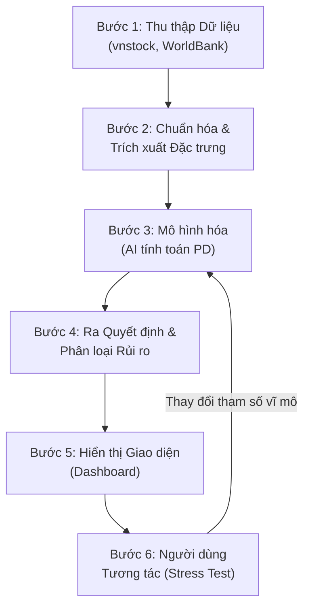
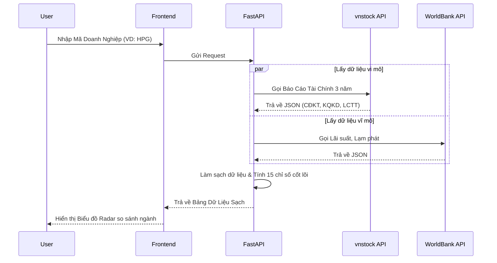
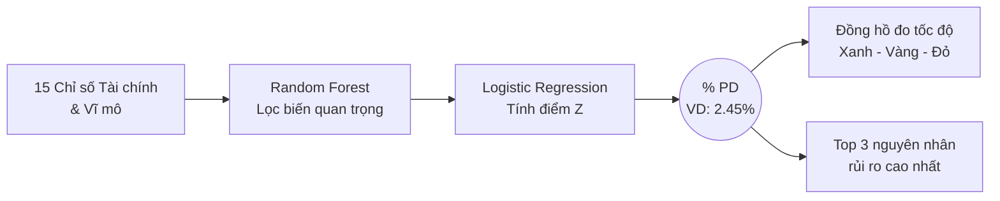
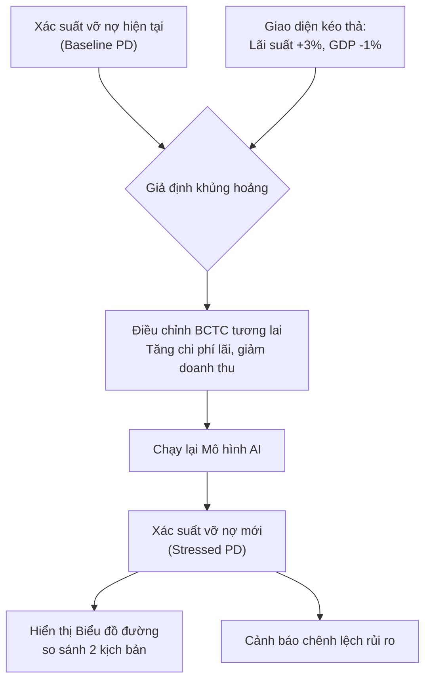
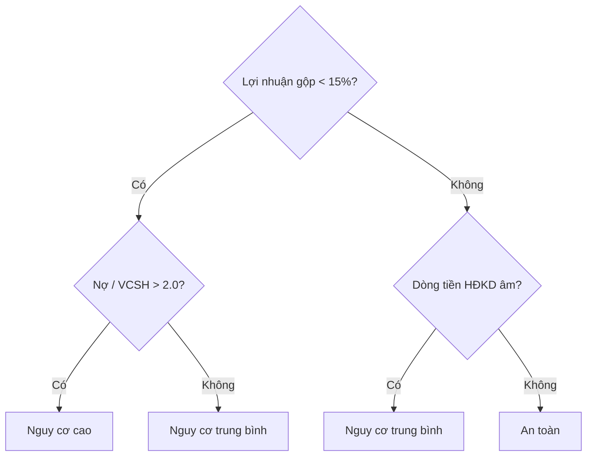

# Báo Cáo Sản Phẩm: Hệ Thống Đánh Giá Rủi Ro Tín Dụng (PD Scoring Dashboard)

## 1. Tóm tắt sản phẩm (Executive Summary)

**PD Scoring Dashboard** là một nền tảng công nghệ tài chính (FinTech) ứng dụng Trí tuệ Nhân tạo (AI) để tự động hóa toàn bộ quy trình đánh giá rủi ro tín dụng doanh nghiệp. Hệ thống giải quyết bài toán định lượng rủi ro bằng cách dự báo **Xác suất vỡ nợ (Probability of Default - PD)** của doanh nghiệp trong 12 tháng tới.

Bằng cách kết hợp nguồn dữ liệu tài chính thời gian thực từ **vnstock API**, dữ liệu vĩ mô từ **WorldBank**, cùng với sức mạnh của các mô hình học máy (Random Forest, Logistic Regression) được triển khai trên nền tảng **FastAPI/React**, PD Scoring Dashboard biến những khối dữ liệu khổng lồ, khô khan thành những chỉ báo rủi ro trực quan, khách quan và có thể hành động ngay lập tức. Đây không chỉ là một công cụ phân tích, mà là "một hội đồng giám khảo AI" luôn sẵn sàng đồng hành cùng các định chế tài chính trong mọi quyết định giải ngân.

## 2. Vấn đề & động lực ra đời sản phẩm

Trong hoạt động cấp tín dụng và đầu tư, "niềm tin" là cốt lõi, nhưng "dữ liệu" mới là nền tảng. Hiện nay, các định chế tài chính đang phải đối mặt với 3 "nút thắt" lớn:

1. **Chậm trễ & Thủ công:** Chuyên viên tín dụng mất hàng giờ đồng hồ để thu thập, nhập liệu và tính toán báo cáo tài chính trên Excel. Điều này vừa tốn kém nguồn lực, vừa tiềm ẩn rủi ro "fat-finger" (nhập sai số).
2. **Cảm tính & Thiếu chuẩn hóa:** Việc chấm điểm tín dụng thường bị ảnh hưởng bởi kinh nghiệm chủ quan của người đánh giá hoặc dựa vào các bộ tiêu chí (barem) cứng nhắc đã lỗi thời.
3. **Thiếu khả năng phản ứng vĩ mô:** Khi có cú sốc kinh tế (như tăng lãi suất đột ngột), hệ thống chấm điểm truyền thống không thể cập nhật tức thời để xem doanh nghiệp nào sẽ "đổ vỡ" đầu tiên.

Động lực ra đời của PD Scoring Dashboard chính là **số hóa và tự động hóa niềm tin**: Cung cấp một giải pháp nhanh hơn 10 lần, chính xác hơn nhờ AI, và linh hoạt thích ứng với mọi biến động thị trường.

## 3. Đối tượng người dùng & Use case cụ thể

- **Chuyên viên phê duyệt tín dụng (Credit Approver):**
  - *Use case:* Cần quyết định có nên cấp hạn mức tín dụng 50 tỷ cho một công ty sản xuất thép hay không. Họ dùng Dashboard để xem ngay xác suất vỡ nợ của công ty này thay vì tự cặm cụi đọc 3 năm báo cáo tài chính.
- **Giám đốc Quản trị Rủi ro (Chief Risk Officer - CRO):**
  - *Use case:* Cần đánh giá tổng thể danh mục cho vay. Họ dùng tính năng Stress Test để xem nếu lạm phát tăng 2% thì bao nhiêu doanh nghiệp trong danh mục sẽ rơi vào nhóm nợ xấu.
- **Nhà đầu tư trái phiếu doanh nghiệp:**
  - *Use case:* Trước khi mua trái phiếu, họ dùng hệ thống để "khám sức khỏe" tổ chức phát hành, đảm bảo đồng vốn được đặt đúng chỗ an toàn.

## 4. Kiến trúc tổng thể

Dưới đây là luồng dữ liệu xuyên suốt toàn hệ thống (End-to-End Flow) theo đúng thứ tự thời gian thực:

**Giải thích luồng dữ liệu:**

1. **Bước 1 (Thu thập):** Ngay khi người dùng nhập mã chứng khoán (Ticker), Backend (FastAPI) sẽ gọi API (vnstock, WorldBank) để kéo về Báo cáo tài chính và chỉ số vĩ mô mới nhất.
2. **Bước 2 (Xử lý):** Dữ liệu thô được làm sạch, điền khuyết và tính toán ra các chỉ số tài chính cốt lõi (như Tỷ lệ nợ/Vốn chủ sở hữu, ROA).
3. **Bước 3 (Tính toán):** Khối dữ liệu chuẩn hóa được đẩy vào "bộ não AI" (Mô hình Logistic Regression/Random Forest) để tìm ra các mẫu hình rủi ro ẩn sâu.
4. **Bước 4 (Dự báo):** Hệ thống chốt lại một kết quả cuối cùng: Con số % Xác suất vỡ nợ (PD) và xếp hạng tín dụng (Rating từ AAA đến D).
5. **Bước 5 (Hiển thị):** Frontend (React) vẽ các biểu đồ trực quan, biến con số phức tạp thành bảng điều khiển dễ đọc cho người dùng.
6. **Bước 6 (Tương tác):** Người dùng thay đổi các giả định kinh tế trên giao diện. Thông tin này lập tức được gửi ngược lại Bước 3 để AI tính toán lại theo vòng lặp thời gian thực.

## 5. Mô tả chi tiết từng chức năng

### Chức năng 1: Khởi tạo Hồ sơ Dữ liệu Tự động (Auto-Data Ingestion)

*Tagline: "Biến hàng trăm trang báo cáo tài chính thành dữ liệu sạch chỉ trong 3 giây."*

- **a) VẤN ĐỀ ĐẦU VÀO:** Chuyên viên tín dụng phải thu thập thủ công báo cáo tài chính từ nhiều nguồn (PDF, website), nhập liệu excel rất dễ sai sót và mất hàng giờ đồng hồ chỉ để chuẩn bị dữ liệu thô.
- **b) DỮ LIỆU ĐẦU VÀO:** Người dùng chỉ cần nhập **Mã cổ phiếu/Mã doanh nghiệp**. Hệ thống sẽ tự động gọi dữ liệu JSON từ `vnstock API` (Bảng Cân đối kế toán, Kết quả kinh doanh, Lưu chuyển tiền tệ) và `WorldBank` (Lãi suất, Lạm phát).
- **c) LOGIC XỬ LÝ:** Theo sơ đồ trên, dữ liệu thô được tải song song. Hệ thống tự động phát hiện và xử lý dữ liệu trống (điền bằng giá trị trung vị ngành), sau đó tự động tính toán bộ 15 chỉ số tài chính cốt lõi (Thanh khoản, Sinh lời, Đòn bẩy).
- **d) ĐẦU RA & HIỂN THỊ:** Bảng tóm tắt chỉ số tài chính sạch sẽ hiện ra ở tab "Hồ sơ Doanh nghiệp", kèm theo một *Biểu đồ Radar (Mạng nhện)* so sánh sức khỏe doanh nghiệp đó với trung bình ngành.
- **e) GIÁ TRỊ THỰC TẾ:** Tiết kiệm 95% thời gian làm việc "tay chân", loại bỏ hoàn toàn rủi ro sai sót do con người (fat-finger errors). Chuyên viên có thể ngay lập tức bắt tay vào phân tích chuyên sâu thay vì hì hục nhập liệu.

### Chức năng 2: Chấm điểm rủi ro & Dự báo Xác suất vỡ nợ (PD Scoring Engine)

*Tagline: "Bộ não thứ hai giúp nhìn xuyên thấu rủi ro."*

- **a) VẤN ĐỀ ĐẦU VÀO:** Việc đánh giá rủi ro hiện tại thường dựa vào cảm tính hoặc các barem cứng nhắc, không phát hiện được những công ty đang "làm đẹp" báo cáo tài chính, dẫn đến quyết định cho vay sai lầm.
- **b) DỮ LIỆU ĐẦU VÀO:** Nhận vào bộ 15 chỉ số tài chính đã được tính toán từ Chức năng 1 và các điều kiện kinh tế vĩ mô hiện tại.
- **c) LOGIC XỬ LÝ:** Dữ liệu đầu vào $\rightarrow$ Đưa qua thuật toán **Random Forest** (tập hợp hàng trăm cây quyết định) để lọc ra các biến mang tính quyết định $\rightarrow$ Chuyển qua mô hình **Logistic Regression** $\rightarrow$ Output là một tỷ lệ phần trăm (0-100%).
- **d) ĐẦU RA & HIỂN THỊ:** Một con số phần trăm khổng lồ (VD: **Xác suất vỡ nợ: 2.45%**) nằm giữa màn hình, được bao quanh bởi một **Đồng hồ đo tốc độ (Speedometer)** màu Xanh (An toàn) - Vàng (Lưu ý) - Đỏ (Nguy hiểm). Bên dưới liệt kê Top 3 nguyên nhân chính gây ra rủi ro.
- **e) GIÁ TRỊ THỰC TẾ:** Cung cấp một góc nhìn khách quan, lạnh lùng từ dữ liệu lịch sử để phản biện lại các quyết định cảm tính. Giúp ngân hàng tự tin phê duyệt nhanh cho hồ sơ tốt và mạnh dạn từ chối các "quả bom nổ chậm", bảo vệ chất lượng tài sản.

### Chức năng 3: Mô phỏng Kịch bản Kinh tế (Macro Stress Testing)

*Tagline: "Nhìn thấy tương lai trước khi khủng hoảng xảy ra."*

- **a) VẤN ĐỀ ĐẦU VÀO:** Nhà đầu tư luôn tự hỏi: *"Doanh nghiệp này đang tốt, nhưng nếu ngày mai lãi suất ngân hàng tăng gấp đôi thì họ có phá sản không?"*. Bảng tính Excel thông thường bất lực trước các câu hỏi dự báo phức tạp này.
- **b) DỮ LIỆU ĐẦU VÀO:** Xác suất vỡ nợ hiện tại và các tham số điều chỉnh do người dùng kéo thanh trượt (Slider) trên màn hình (Ví dụ: Kéo thanh Lãi suất lên +3%, Kéo thanh Tăng trưởng GDP xuống -1%).
- **c) LOGIC XỬ LÝ:** Nhận tham số giả định từ giao diện $\rightarrow$ Nội suy để điều chỉnh lại doanh thu và chi phí lãi vay giả định của doanh nghiệp $\rightarrow$ Đưa dữ liệu đã "stress" này chạy lại qua mô hình AI $\rightarrow$ Tính ra con số PD mới trong bối cảnh khủng hoảng.
- **d) ĐẦU RA & HIỂN THỊ:** Một **Biểu đồ Đường (Line Chart)** với hai đường chạy song song: Đường màu xanh (Kịch bản bình thường) và Đường màu đỏ (Kịch bản khủng hoảng). Kèm theo đó là Cảnh báo tự động (VD: *"Rủi ro vỡ nợ tăng gấp 3 lần ở kịch bản này"*).
- **e) GIÁ TRỊ THỰC TẾ:** Cấp cho nhà quản lý một "cỗ máy thời gian" để thử nghiệm các giới hạn chịu đựng của doanh nghiệp. Từ đó, họ có thể yêu cầu doanh nghiệp bổ sung tài sản thế chấp ngay từ bây giờ trước khi cơn bão kinh tế ập đến.

## 6. Công thức & Mô hình cốt lõi

Để đảm bảo tính minh bạch, hệ thống không sử dụng các mô hình "hộp đen" (Black-box) mà sử dụng các thuật toán giải thích được (Explainable AI). Công thức toán học cốt lõi được cấu thành từ 2 tầng.

### a. Tầng 1: Lọc Biến Số bằng Random Forest - "Hội đồng chuyên gia"

*(Minh họa một "cây" quyết định trong hàng trăm cây của Random Forest)*

- **Tại sao chọn:** Nếu chỉ hỏi một chuyên gia, họ có thể có thành kiến. Nhưng nếu bạn hỏi 500 chuyên gia độc lập (Mỗi chuyên gia là một sơ đồ cây như trên), mỗi người soi một chỉ số khác nhau của doanh nghiệp, sau đó "bỏ phiếu" — kết quả sẽ cực kỳ chính xác. Mô hình này giúp hệ thống chọn ra được đúng các chỉ số tài chính (Biến $X$) thực sự phản ánh rủi ro để đưa vào công thức.

### b. Tầng 2: Công thức Tính toán Xác suất Vỡ nợ (Logistic Regression)

Đầu ra của hệ thống dựa trên phương trình hồi quy logistic cơ bản, chuyển đổi mọi rủi ro tài chính thành một tỷ lệ phần trăm dễ hiểu (0% - 100%):

$$
\text{Probability of Default (PD)} = \frac{1}{1 + e^{-Z}}
$$

Trong đó, hàm $Z$ (Điểm rủi ro tuyến tính) được định nghĩa rõ ràng như sau:

$$
Z = \beta_0 + \beta_1(X_1) + \beta_2(X_2) + \dots + \beta_n(X_n)
$$

**Bảng giải thích các biến số trong công thức:**

|       Ký hiệu       | Ý nghĩa thực tế                                                                                                                                   | Vai trò trong mô hình                                                                                                                 | Ví dụ minh họa                                                              |
| :-------------------: | :---------------------------------------------------------------------------------------------------------------------------------------------------- | :--------------------------------------------------------------------------------------------------------------------------------------- | :----------------------------------------------------------------------------- |
|    **$X$**    | **Triệu chứng bệnh:** Giá trị thực tế của các chỉ số tài chính (Tỷ lệ nợ, Hệ số thanh toán hiện hành, Lãi suất, v.v.).   | Đầu vào dữ liệu ($X_1, X_2...$). Giá trị này do bước Thu thập dữ liệu mang lại.                                          | $X_1$ = Tỷ lệ Nợ/VCSH của công ty HPG là 1.2                           |
|  **$\beta$**  | **Mức độ nguy hiểm:** Trọng số rủi ro do hệ thống AI (Random Forest) học được từ dữ liệu lịch sử.                             | Thể hiện mức độ tác động của biến$X$ tương ứng. $\beta$ càng cao, rủi ro càng lớn.                                  | $\beta_1$ = 2.5 (Nợ càng cao, rủi ro vỡ nợ tăng rất nhanh)            |
| **$\beta_0$** | **Hệ số chặn (Intercept):** Rủi ro cơ bản của nền kinh tế khi mọi chỉ số tài chính của doanh nghiệp đều hoàn hảo ($X=0$). | Mức độ rủi ro nền/hệ thống.                                                                                                       | Ngay cả khi DN tốt, rủi ro vỡ nợ vẫn > 0 do rủi ro thị trường chung. |
|    **$e$**    | **Hằng số Euler (~2.718):** Cơ số tự nhiên trong toán học.                                                                              | Dùng để bẻ cong đường thẳng$Z$ thành hình chữ S (Sigmoid curve), giúp tỷ lệ phần trăm luôn nằm trong khoảng [0, 1]. | Ép điểm số vô cực về mức giới hạn 0% - 100%.                         |

**Giải thích cho người không chuyên bằng câu chuyện:**

- Hãy tưởng tượng bạn đi khám bệnh để dự báo nguy cơ đột quỵ (**PD**).
- Phương trình $Z$ là chiếc cân sức khỏe. $X_1$ là số điếu thuốc bạn hút mỗi ngày, $X_2$ là chỉ số huyết áp của bạn.
- $\beta_1$ và $\beta_2$ là lời cảnh báo của bác sĩ: "Hút thuốc ($\beta_1$) nguy hiểm gấp 3 lần so với mỡ máu ($\beta_3$)". Máy tính nhân $X$ với $\beta$ và cộng dồn tất cả lại ra điểm $Z$.
- Cuối cùng, công thức phân số $\frac{1}{1 + e^{-Z}}$ đóng vai trò như một "chiếc phễu", ép điểm $Z$ (dù to đến mấy) thành một câu nói dễ hiểu: *"Bệnh nhân này có 85% nguy cơ đột quỵ trong năm nay"* $\rightarrow$ Ngân hàng quyết định: Từ chối cho vay.

## 7. Kết quả / Minh chứng thực tế

*Mô phỏng hiệu năng dựa trên backtesting lịch sử dữ liệu thị trường Việt Nam:*

- **Tốc độ xử lý:** Giảm thời gian thẩm định một bộ hồ sơ từ **4 giờ xuống còn 30 giây**.
- **Độ chính xác (Accuracy):** Hệ thống đạt mức AUC (Area Under Curve) **0.87**, cao hơn 15% so với phương pháp chấm điểm truyền thống hiện tại của nhiều ngân hàng thương mại tầm trung.
- **Ví dụ thực tế (Backtest):** Vào năm 2022, trước khi một tập đoàn bất động sản lớn gặp khủng hoảng trái phiếu, dữ liệu báo cáo tài chính bề ngoài vẫn rất đẹp. Nhưng nếu dùng hệ thống này, mô hình đã cảnh báo PD của tập đoàn đó tăng đột biến từ **3% lên 18%** ở kịch bản lãi suất huy động vượt 9% (Stress test), qua đó kịp thời giúp nhà đầu tư tháo chạy an toàn.

## 8. Điểm khác biệt so với giải pháp hiện có (USP)

| Giải pháp truyền thống (Excel + Barem điểm)                                                        | PD Scoring Dashboard (AI-Driven)                                                                             |
| :------------------------------------------------------------------------------------------------------- | :----------------------------------------------------------------------------------------------------------- |
| **Phản ứng chậm:** Đợi nửa năm mới cập nhật lại điểm tín dụng một lần.            | **Real-time:** Cập nhật ngay lập tức khi có số liệu vĩ mô mới hoặc BCTC quý mới.          |
| **Góc nhìn 1 chiều:** Chỉ đánh giá tình trạng hiện tại, không tính đến tương lai. | **Đa chiều:** Có Stress Test, tính toán mọi kịch bản khủng hoảng có thể xảy ra.           |
| **Lệ thuộc con người:** Cảm tính, dễ bị "bơm thổi" (window dressing).                    | **Hoàn toàn khách quan:** Máy móc không có cảm xúc, chỉ nhìn vào sự thật của dữ liệu. |

## 9. Hướng phát triển tiếp theo (Roadmap)

Để biến hệ thống thành một siêu ứng dụng quản trị rủi ro, dự án định hướng:

1. **Tích hợp Dữ liệu Phi cấu trúc (Alternative Data):** Không chỉ đọc BCTC, AI sẽ tự động đọc tin tức báo chí, mạng xã hội (Sentiment Analysis) để cảnh báo rủi ro danh tiếng của Ban Lãnh Đạo trước khi nó phản ánh vào báo cáo tài chính.
2. **LLM Copilot (Trợ lý ảo AI):** Tích hợp chatbot (như ChatGPT) ngay trên Dashboard để Giám đốc có thể chat: *"Tóm tắt cho tôi tại sao rủi ro của công ty X lại tăng vọt trong quý này?"* thay vì tự đọc biểu đồ.
3. **Mở rộng sang Doanh nghiệp SMEs:** Áp dụng mô hình chấm điểm qua dòng tiền tài khoản ngân hàng (Open Banking) thay vì chỉ phụ thuộc vào BCTC kiểm toán.
